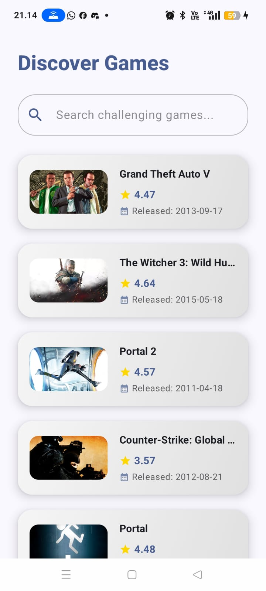
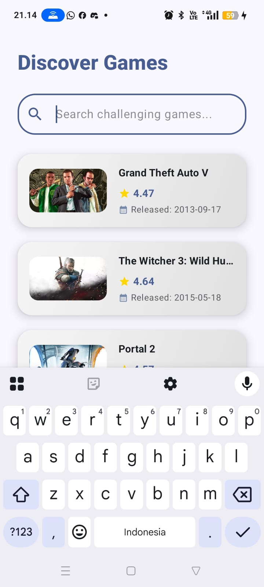
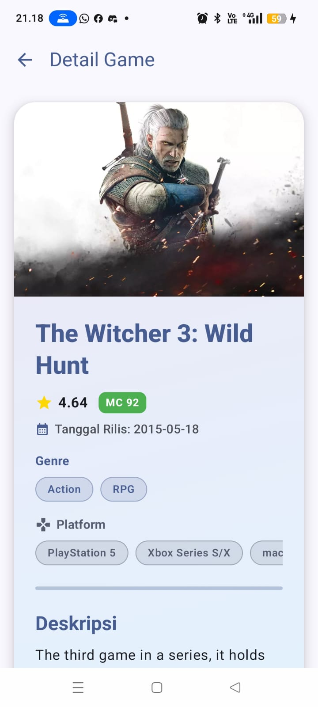
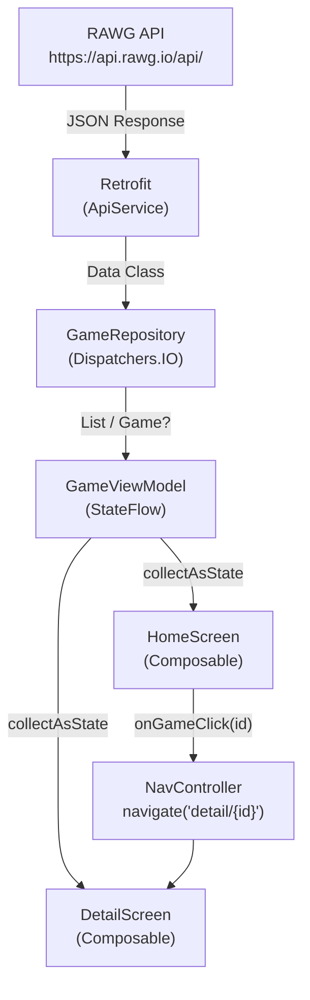

# Aplikasi Katalog dan Eksplorasi Video Game

Aplikasi Android berbasis **Kotlin** dan **Jetpack Compose** yang memungkinkan pengguna menjelajahi dan mencari katalog video game secara *real-time* menggunakan data dari **RAWG Video Games Database API**. Aplikasi ini dibangun sebagai tugas responsi mata kuliah **Mobile Programming**.

---

## Screenshot Aplikasi

|              Home Screen              |              Hasil Pencarian              |               Game Detail Screen               |
|:-------------------------------------:|:-----------------------------------------:|:----------------------------------------------:|
|  |  |  |

---

##Fitur Utama

- **Real-Time Search** — Search games by name with state-driven UI and live recomposition
- **Daftar Game** — Menampilkan katalog game dalam `LazyColumn` yang efisien dan scrollable
- **Thumbnail Game** — Menampilkan gambar latar (_background image_) tiap game menggunakan Coil
- **Rating Game** — Menampilkan rating numerik dengan ikon bintang
- **Release Date** — Displayed with a calendar icon and "Released:" label (Home) / "Tanggal Rilis:" (Detail)
- **Detail Game** — Card bergradasi dengan judul, rating, badge Metacritic, tanggal rilis, genre, platform, dan deskripsi
- **Genre & Platform** — Ditampilkan sebagai chip scroll-horizontal di halaman detail
- **Badge Metacritic** — Berwarna hijau/kuning/merah sesuai skor
- **Dark / Light Mode** — Mendukung dynamic color (Android 12+) dan fallback color scheme kustom
- **Loading Indicator** — `CircularProgressIndicator` ditampilkan selama data dimuat dari API

---

## Tech Stack

| Teknologi | Versi | Kegunaan |
|-----------|-------|----------|
| Kotlin | 2.2.10 | Bahasa pemrograman utama |
| Jetpack Compose (BOM) | 2026.02.01 | Framework UI deklaratif |
| Material Design 3 | (via Compose BOM) | Komponen dan sistem desain UI |
| Retrofit | 2.9.0 | HTTP client untuk konsumsi REST API |
| OkHttp + Logging Interceptor | 4.12.0 | HTTP layer & logging jaringan |
| Gson Converter | 2.9.0 | Deserialisasi JSON ke data class Kotlin |
| Coil Compose | 2.5.0 | Memuat dan menampilkan gambar dari URL |
| Navigation Compose | 2.7.7 | Navigasi antar screen berbasis Compose |
| ViewModel + StateFlow | 2.7.0 / 2.11.0 | State management & lifecycle-aware |
| RAWG API | v1 | Sumber data katalog video game |

---

## Arsitektur MVVM

Aplikasi mengikuti pola arsitektur **MVVM (Model–View–ViewModel)** yang memisahkan tanggung jawab tiap lapisan secara tegas.

### Alur Data

```
RAWG API (Internet)
      │  HTTP Response (JSON)
      ▼
  Retrofit (ApiService)
      │  Parsing JSON → Data Class
      ▼
  ApiClient (OkHttpClient + Retrofit instance)
      │
      ▼
  GameRepository
      │  suspend fun, Dispatchers.IO
      ▼
  GameViewModel
      │  MutableStateFlow → StateFlow
      ▼
  UI Layer (Composable)
      │  collectAsState()
      ▼
  Tampilan ke Pengguna
```

### Diagram Arsitektur (Mermaid)



### Peran Tiap Lapisan

| Lapisan | File | Tanggung Jawab |
|---------|------|----------------|
| **Model** | `Game.kt` | Mendefinisikan struktur data (`data class`) yang memetakan respons JSON dari RAWG API |
| **Network** | `ApiService.kt`, `ApiClient.kt` | Mendefinisikan endpoint HTTP dan membuat instance Retrofit + OkHttp |
| **Repository** | `GameRepository.kt` | Menjadi perantara antara sumber data (API) dan ViewModel; menjalankan operasi jaringan di thread IO |
| **ViewModel** | `GameViewModel.kt` | Mengelola state UI (`StateFlow`), memanggil repository, dan mengekspos data ke composable |
| **UI** | `HomeScreen.kt`, `DetailScreen.kt`, `NavGraph.kt` | Merender tampilan berdasarkan state dari ViewModel; tidak mengandung logika bisnis |

---

## 🔧 Penjelasan Teknis

### a. Kotlin: Data Class, Null Safety, dan Lambda

Model data didefinisikan menggunakan `data class` Kotlin dengan anotasi `@SerializedName` untuk memetakan nama field JSON yang berbeda dari nama property Kotlin. Null safety diterapkan pada field yang tidak selalu tersedia dari API.

```kotlin
// model/Game.kt
data class GameResponse(
    val results: List<Game>
)

data class Game(
    val id: Int,
    val name: String,
    val rating: Double,
    val released: String?,                                          // nullable — tidak selalu ada
    @SerializedName("background_image") val backgroundImage: String?, // nullable & mapping JSON key
    val description_raw: String?,                                   // nullable — hanya dari endpoint /games/{id}
    val metacritic: Int?,                                           // nullable — tidak semua game punya skor Metacritic
    val genres: List<Genre>?,                                       // nullable — daftar genre game
    val platforms: List<PlatformWrapper>?                           // nullable — daftar platform yang tersedia
)

data class Genre(
    val id: Int,
    val name: String
)

data class PlatformWrapper(
    val platform: PlatformDetail
)

data class PlatformDetail(
    val id: Int,
    val name: String,
    val slug: String
)
```

Lambda digunakan sebagai parameter callback navigasi pada composable:

```kotlin
// HomeScreen.kt — lambda sebagai parameter fungsi
fun HomeScreen(viewModel: GameViewModel, onGameClick: (Int) -> Unit)

// Pemanggilan lambda saat item diklik
GameItem(game = game, onClick = { onGameClick(game.id) })
```

Null safety juga diterapkan menggunakan `?.let { }` untuk menampilkan field opsional:

```kotlin
// HomeScreen.kt — tampilkan tanggal rilis hanya jika tidak null
game.released?.let { releaseDate ->
    Text(
        text = "Released: $releaseDate",
        style = MaterialTheme.typography.bodySmall,
        color = MaterialTheme.colorScheme.onSurface.copy(alpha = 0.7f)
    )
}
```

---

### b. UI: Composable Layout, Material Design 3, Theme, dan Typography

Seluruh UI dibangun menggunakan fungsi `@Composable`. Layout menggunakan komponen `Scaffold`, `Column`, `Row`, `Card`, dan `Box` dari Jetpack Compose.

```kotlin
// HomeScreen.kt — struktur layout utama
@OptIn(ExperimentalMaterial3Api::class)
@Composable
fun HomeScreen(viewModel: GameViewModel, onGameClick: (Int) -> Unit) {
    Scaffold(
        containerColor = MaterialTheme.colorScheme.background
    ) { padding ->
        Column(
            modifier = Modifier
                .padding(padding)
                .fillMaxSize()
                .background(MaterialTheme.colorScheme.background)
        ) {
            Text(
                text = "Discover Games",
                style = MaterialTheme.typography.headlineMedium,
                color = MaterialTheme.colorScheme.primary,
                fontWeight = FontWeight.ExtraBold,
                modifier = Modifier.padding(start = 24.dp, top = 32.dp, end = 24.dp, bottom = 8.dp)
            )
            // search bar + LazyColumn berada di bawahnya
        }
    }
}
```

**Color Scheme Kustom** didefinisikan di `Color.kt` dan digunakan pada `Theme.kt`:

```kotlin
// theme/Color.kt
val PurplePrimary   = Color(0xFF4A00E0)
val PurpleSecondary = Color(0xFF7E57C2)
val TealAccent      = Color(0xFF03DAC5)
val DarkBg          = Color(0xFF000000)
val DarkSurface     = Color(0xFF1E1E1E)
val LightBg         = Color(0xFFF0F0F0)
val LightSurface    = Color(0xFFFFFFFF)
```

**Theme** mendukung dynamic color (Android 12+) dengan fallback ke skema warna kustom:

```kotlin
// theme/Theme.kt
@Composable
fun ResponsiTheme(
    darkTheme: Boolean = isSystemInDarkTheme(),
    dynamicColor: Boolean = true,
    content: @Composable () -> Unit
) {
    val colorScheme = when {
        dynamicColor && Build.VERSION.SDK_INT >= Build.VERSION_CODES.S -> {
            val context = LocalContext.current
            if (darkTheme) dynamicDarkColorScheme(context) else dynamicLightColorScheme(context)
        }
        darkTheme -> DarkColorScheme
        else      -> LightColorScheme
    }
    MaterialTheme(colorScheme = colorScheme, typography = Typography, content = content)
}
```

**Typography** dikustomisasi di `Type.kt` dan direferensikan melalui `MaterialTheme.typography`:

```kotlin
// theme/Type.kt
val Typography = Typography(
    bodyLarge = TextStyle(
        fontFamily = FontFamily.Default,
        fontWeight = FontWeight.Normal,
        fontSize = 16.sp,
        lineHeight = 24.sp,
        letterSpacing = 0.5.sp
    )
)
```

---

### c. List: LazyColumn dan Alasan Pemilihannya

Daftar game ditampilkan menggunakan **`LazyColumn`**, yaitu komponen Compose yang hanya merender item yang terlihat di layar (_on-demand rendering_).

```kotlin
// HomeScreen.kt
LazyColumn(
    modifier = Modifier.fillMaxSize(),
    contentPadding = PaddingValues(bottom = 24.dp)
) {
    items(games) { game ->
        GameItem(game = game, onClick = { onGameClick(game.id) })
    }
}
```

**Alasan memilih `LazyColumn`:**
- Data game dari API bisa berjumlah puluhan hingga ratusan item. `LazyColumn` hanya merender item yang tampak di viewport, sehingga konsumsi memori jauh lebih efisien dibanding `Column` biasa.
- Mendukung scroll vertikal secara native.
- Sesuai untuk tampilan daftar satu kolom (list vertikal), berbeda dengan `LazyVerticalGrid` yang cocok untuk tampilan grid multi-kolom.

---

### d. State dan Recomposition: Cara Search Bekerja

State pencarian dikelola menggunakan `MutableStateFlow` di ViewModel dan dikonsumsi oleh composable melalui `collectAsState()`.

**Alur kerja search:**

1. Pengguna mengetik di `OutlinedTextField` → `onValueChange` dipanggil
2. `viewModel.onSearchQueryChange(query)` dieksekusi
3. `_searchQuery.value = query` diperbarui → memicu recomposition pada TextField
4. `fetchGames(query)` dipanggil → data baru diambil dari API
5. `_games.value = results` diperbarui → memicu recomposition pada `LazyColumn`

```kotlin
// GameViewModel.kt
private val _searchQuery = MutableStateFlow("")
val searchQuery: StateFlow<String> = _searchQuery.asStateFlow()

fun onSearchQueryChange(query: String) {
    _searchQuery.value = query   // update state query
    fetchGames(query)            // trigger fetch dengan query baru
}
```

```kotlin
// HomeScreen.kt — mengonsumsi state dari ViewModel
val games       by viewModel.games.collectAsState()
val searchQuery by viewModel.searchQuery.collectAsState()
val isLoading   by viewModel.isLoading.collectAsState()

OutlinedTextField(
    value = searchQuery,
    onValueChange = { viewModel.onSearchQueryChange(it) },
    placeholder = { Text("Search challenging games...") },
    singleLine = true
)
```

Setiap kali `StateFlow` berubah nilai, semua composable yang membaca state tersebut via `collectAsState()` akan otomatis di-_recompose_ oleh Compose runtime — hanya bagian UI yang bergantung pada state itu yang dirender ulang, bukan seluruh halaman.

---

### e. Networking: Endpoint RAWG, Interface Retrofit, dan Model Response

**Endpoint yang digunakan:**

| Method | Endpoint | Kegunaan |
|--------|----------|----------|
| `GET` | `/games` | Mengambil daftar game; mendukung parameter `search` |
| `GET` | `/games/{id}` | Mengambil data detail satu game berdasarkan ID |

**Interface Retrofit (`ApiService.kt`):**

```kotlin
// network/ApiService.kt
interface ApiService {
    @GET("games")
    suspend fun getGames(
        @Query("key") apiKey: String,
        @Query("search") searchQuery: String = ""
    ): GameResponse

    @GET("games/{id}")
    suspend fun getGameDetail(
        @Path("id") id: Int,
        @Query("key") apiKey: String
    ): Game
}
```

**Inisialisasi Retrofit (`ApiClient.kt`):**

```kotlin
// network/ApiClient.kt
object ApiClient {
    private const val BASE_URL = "https://api.rawg.io/api/"

    private val loggingInterceptor = HttpLoggingInterceptor().apply {
        level = HttpLoggingInterceptor.Level.BODY
    }

    private val client = OkHttpClient.Builder()
        .addInterceptor(loggingInterceptor)
        .build()

    private val retrofit = Retrofit.Builder()
        .baseUrl(BASE_URL)
        .client(client)
        .addConverterFactory(GsonConverterFactory.create())
        .build()

    val apiService: ApiService = retrofit.create(ApiService::class.java)
}
```

`ApiClient` menggunakan pola **`object`** (singleton) agar instance Retrofit hanya dibuat satu kali. `HttpLoggingInterceptor` digunakan untuk mencetak log request/response HTTP saat debugging.

---

### f. Arsitektur: Repository dan ViewModel

**Repository** (`GameRepository.kt`) bertanggung jawab mengeksekusi operasi jaringan dan menyembunyikan detail implementasi API dari ViewModel:

```kotlin
// repository/GameRepository.kt
class GameRepository {
    private val apiService = ApiClient.apiService

    suspend fun getGames(searchQuery: String = ""): List<Game> {
        return withContext(Dispatchers.IO) {
            try {
                val response = apiService.getGames(apiKey = apiKey, searchQuery = searchQuery)
                response.results
            } catch (e: Exception) {
                emptyList()    // kembalikan list kosong jika terjadi error
            }
        }
    }

    suspend fun getGameDetail(id: Int): Game? {
        return withContext(Dispatchers.IO) {
            try {
                apiService.getGameDetail(id = id, apiKey = apiKey)
            } catch (e: Exception) {
                null           // kembalikan null jika terjadi error
            }
        }
    }
}
```

**ViewModel** (`GameViewModel.kt`) mengelola seluruh state UI dan memanggil repository melalui `viewModelScope.launch`:

```kotlin
// viewmodel/GameViewModel.kt
class GameViewModel : ViewModel() {
    private val repository = GameRepository()

    private val _games        = MutableStateFlow<List<Game>>(emptyList())
    val games: StateFlow<List<Game>> = _games.asStateFlow()

    private val _isLoading    = MutableStateFlow(false)
    val isLoading: StateFlow<Boolean> = _isLoading.asStateFlow()

    private val _searchQuery  = MutableStateFlow("")
    val searchQuery: StateFlow<String> = _searchQuery.asStateFlow()

    private val _selectedGame = MutableStateFlow<Game?>(null)
    val selectedGame: StateFlow<Game?> = _selectedGame.asStateFlow()

    init { fetchGames() }   // muat data awal saat ViewModel dibuat

    private fun fetchGames(query: String = "") {
        viewModelScope.launch {
            _isLoading.value = true
            _games.value = repository.getGames(query)
            _isLoading.value = false
        }
    }

    fun fetchGameDetail(id: Int) {
        viewModelScope.launch {
            _isLoading.value = true
            _selectedGame.value = repository.getGameDetail(id)
            _isLoading.value = false
        }
    }

    fun clearSelectedGame() { _selectedGame.value = null }
}
```

---

### g. Screens dan Navigasi

Navigasi dikelola oleh **`AppNavGraph`** menggunakan `NavHost` dari Jetpack Navigation Compose. Satu instance `GameViewModel` dibagikan ke kedua screen.

```kotlin
// ui/NavGraph.kt
@Composable
fun AppNavGraph() {
    val navController = rememberNavController()
    val viewModel: GameViewModel = viewModel()

    NavHost(navController = navController, startDestination = "home") {
        composable("home") {
            HomeScreen(viewModel = viewModel, onGameClick = { gameId ->
                navController.navigate("detail/$gameId")
            })
        }
        composable("detail/{gameId}") { backStackEntry ->
            val gameId = backStackEntry.arguments?.getString("gameId")?.toIntOrNull()
            if (gameId != null) {
                DetailScreen(viewModel = viewModel, gameId = gameId, onNavigateBack = {
                    navController.popBackStack()
                })
            }
        }
    }
}
```

**Home Screen** (`HomeScreen.kt`):
- Menampilkan judul "Discover Games", search bar, dan daftar game dalam `LazyColumn`
- Setiap `GameItem` menampilkan gambar (_background image_), nama, rating, dan tanggal rilis
- Menampilkan `CircularProgressIndicator` saat data sedang dimuat

**Game Detail Screen** (`DetailScreen.kt`):
- Dipanggil dengan `gameId` sebagai argumen navigasi
- `LaunchedEffect(gameId)` memicu `fetchGameDetail(gameId)` saat screen pertama kali ditampilkan
- `DisposableEffect` memanggil `clearSelectedGame()` saat screen di-_dispose_ agar state tidak bocor ke sesi berikutnya
- Card menggunakan **gradasi warna** (ungu→biru gelap untuk dark mode; lavender→biru muda untuk light mode)
- Menampilkan gambar header, judul, rating bintang, **badge Metacritic** (hijau ≥75 / kuning ≥50 / merah <50)
- **Tanggal rilis** ditampilkan dengan ikon kalender (`Icons.Default.CalendarMonth`) dan label "Tanggal Rilis:"
- **Genre** ditampilkan sebagai chip scroll-horizontal menggunakan `LazyRow`
- **Platform** ditampilkan sebagai chip scroll-horizontal menggunakan `LazyRow` dengan ikon Gamepad
- Deskripsi lengkap dengan label "Deskripsi" (Bahasa Indonesia) dan scroll vertikal

```kotlin
// DetailScreen.kt — lifecycle management
LaunchedEffect(gameId) {
    viewModel.fetchGameDetail(gameId)   // fetch saat screen muncul
}

DisposableEffect(Unit) {
    onDispose {
        viewModel.clearSelectedGame()   // bersihkan state saat screen ditutup
    }
}
```

---

## Tabel Data yang Ditampilkan

> Data berikut diambil dari dua endpoint RAWG API: `/games` (list) dan `/games/{id}` (detail).

| Field API | Nama Property (Kotlin) | Tipe Data | Endpoint | Home Screen | Detail Screen |
|-----------|------------------------|-----------|----------|:-----------:|:-------------:|
| `id` | `id` | `Int` | `/games` & `/games/{id}` | ✗ (key navigasi) | ✗ |
| `name` | `name` | `String` | `/games` & `/games/{id}` | ✅ | ✅ |
| `rating` | `rating` | `Double` | `/games` & `/games/{id}` | ✅ (ikon ⭐) | ✅ (ikon ⭐) |
| `released` | `released` | `String?` | `/games` & `/games/{id}` | ✅ (ikon 📅 "Released:") | ✅ (ikon 📅 "Tanggal Rilis:") |
| `background_image` | `backgroundImage` | `String?` | `/games` & `/games/{id}` | ✅ (thumbnail) | ✅ (header) |
| `description_raw` | `description_raw` | `String?` | `/games/{id}` saja | ✗ | ✅ (label "Deskripsi") |
| `metacritic` | `metacritic` | `Int?` | `/games` & `/games/{id}` | ✗ | ✅ (badge warna) |
| `genres` | `genres` | `List<Genre>?` | `/games` & `/games/{id}` | ✗ | ✅ (chip LazyRow) |
| `platforms` | `platforms` | `List<PlatformWrapper>?` | `/games` & `/games/{id}` | ✗ | ✅ (chip LazyRow) |

---

## Struktur Folder Project

```
Responsi/
├── app/
│   ├── src/
│   │   └── main/
│   │       ├── java/com/example/responsi/
│   │       │   ├── MainActivity.kt
│   │       │   ├── model/
│   │       │   │   └── Game.kt                  # Data class: Game & GameResponse
│   │       │   ├── network/
│   │       │   │   ├── ApiClient.kt             # Singleton Retrofit instance
│   │       │   │   └── ApiService.kt            # Interface endpoint RAWG API
│   │       │   ├── repository/
│   │       │   │   └── GameRepository.kt        # Lapisan akses data
│   │       │   ├── viewmodel/
│   │       │   │   └── GameViewModel.kt         # State management & logika bisnis
│   │       │   └── ui/
│   │       │       ├── HomeScreen.kt            # Composable halaman utama
│   │       │       ├── DetailScreen.kt          # Composable halaman detail
│   │       │       ├── NavGraph.kt              # Konfigurasi navigasi
│   │       │       └── theme/
│   │       │           ├── Color.kt             # Definisi warna kustom
│   │       │           ├── Theme.kt             # ResponsiTheme composable
│   │       │           └── Type.kt              # Konfigurasi typography
│   │       ├── AndroidManifest.xml
│   │       └── res/
│   ├── build.gradle.kts
│   └── proguard-rules.pro
├── gradle/
│   └── libs.versions.toml                       # Version catalog dependencies
├── build.gradle.kts
├── settings.gradle.kts
└── README.md
```

---

## Cara Menjalankan

### Prasyarat
- Android Studio **Hedgehog** atau lebih baru
- JDK 11
- Koneksi internet aktif

### Langkah-langkah

1. **Clone repository ini:**
   ```bash
   git clone https://github.com/[ISI_USERNAME]/[ISI_REPO_NAME].git
   cd [ISI_REPO_NAME]
   ```

2. **Dapatkan API Key RAWG:**
   - Kunjungi [https://rawg.io/apidocs](https://rawg.io/apidocs)
   - Daftar atau masuk ke akun RAWG
   - Salin API key yang diberikan

3. **Simpan API Key di `local.properties`:**
   ```properties
   # local.properties (JANGAN di-commit ke Git!)
   sdk.dir=C\:\\Users\\NamaAnda\\AppData\\Local\\Android\\Sdk
   RAWG_API_KEY=masukkan_api_key_anda_di_sini
   ```

   > **Penting:** Pastikan `local.properties` sudah masuk dalam daftar `.gitignore` agar API key tidak ikut ter-commit ke repositori publik.

   > **Catatan:** Pada versi kode saat ini, API key dikelola langsung di dalam `GameRepository.kt`. Untuk keamanan di lingkungan produksi, sebaiknya pindahkan ke `local.properties` dan akses melalui `BuildConfig`.

4. **Buka project di Android Studio:**
   - **File → Open** → pilih folder project `Responsi/`

5. **Sinkronisasi Gradle:**
   - Klik **"Sync Now"** pada notifikasi yang muncul, atau
   - Klik **File → Sync Project with Gradle Files**

6. **Jalankan aplikasi:**
   - Pilih emulator atau hubungkan perangkat fisik (minimal **API 29 / Android 10**)
   - Klik tombol **Run ▶** atau tekan `Shift + F10`

---

## Video Penjelasan Kode

[LINK VIDEO]

---

## Identitas Pembuat

| Keterangan | Detail                                                |
|------------|-------------------------------------------------------|
| **Nama** | [Wati Rustati]                                        |
| **NIM** | [H1D024007]                                           |
| **Kelas** | [Shift lama: B, Shift baru: F]                        |
| **Mata Kuliah** | Praktikum Mobile Programming                          |
| **Tugas** | Responsi — Aplikasi Katalog dan Eksplorasi Video Game |
